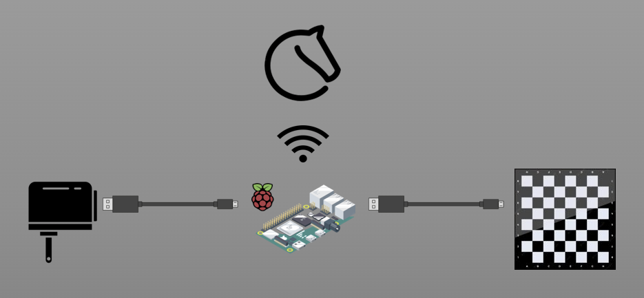

# certabo-lichess
Standalone, headless software to link Certabo chessboards with Lichess.

## Synopsis
This software allows you to play any game on Lichess with your Certabo (https://www.certabo.com/) digital chessboard. The software is headless and does not require additional drivers or libs. It is best deployed on a minicomputer like a Raspberry Pi, so the board can be hooked up in this fashion:

When powered on with this software running, the board will automatically snap into your "foreground" game on Lichess. You can also pick up games that are already running. It is also possible to intermittendly make moves on another device, or continue a game elsewhere. If you power the board while no game is running, the software will wait until one has started. Similarly, when all games have ended, it will wait for a new one to start.

## What you need

- A (mini) computer running Linux with USB and recent node/npm installation.
- A Lichess account, with an API token that has Board-API enabled (generate it here: https://lichess.org/account/oauth/token).

## Setup instructions

- Clone this repo.
- Run `npm install` inside the repo dir to install the serial port module and its dependencies.
- Run `node certabo-lichess.js <serialDevice> <lichessName> <lichessToken>` inside the repo dir, where
  - `<serialDevice>` is usually something like `/dev/ttyUSB0`. See below for an UDEV recipe to normalize the name.
  - `<lichessName>` is your account name on Lichess. It is printed in the upper right corner of the Lichess web interface.
  - `<lichessToken>` is the API token.
- When starting for the first time, the board will need to map the RFID codes for the pieces. Place all pieces in standard base setup. Extra queens can optionally go on any square of rows 3+4 for white, and rows 5+6 for black. Once all rows 1+2 and 7+8 are filled, the board will save the RFID mappings and go into game mode. If you ever need to repeat piece mappings, either delete `$HOME/.certabo-lichess` or power on the board with a single piece on square A1.
- The software is designed to run permanently. It is recommended to run it inside `screen` or `tmux` or similar for that purpose.
